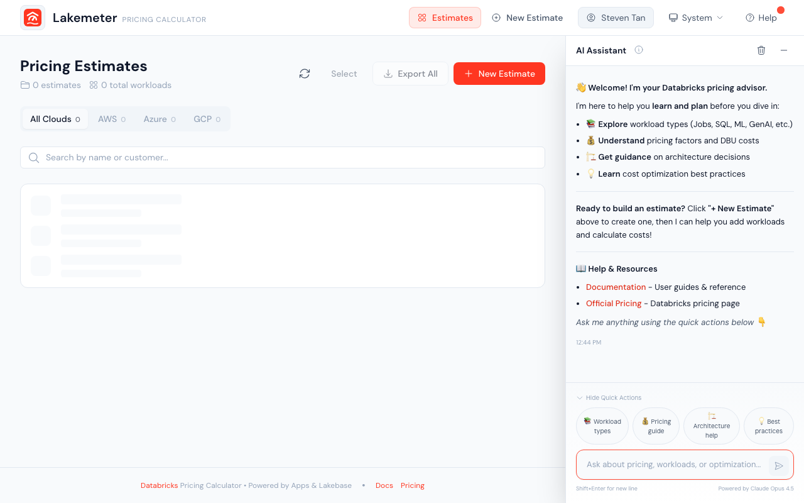

# Lakemeter

A Databricks cost estimation tool that runs as a **Databricks App** with built-in SSO authentication.

Create, manage, and export transparent sizing estimates for supported Databricks workloads.



## Features

- **Workload-specific sizing** — Configure usage assumptions with forms tailored to each supported workload
- **AI assistant** — Describe your workload in natural language, review the suggestion, and accept with one click
- **Excel export** — Full cost breakdowns with SKU details, discount calculations, and VM pricing
- **Pricing tools** — Use the [SKU Explorer](https://databrickslabs.github.io/lakemeter-oss/user-guide/pricing/sku-explorer) and [FMAPI Tokens](https://databrickslabs.github.io/lakemeter-oss/user-guide/pricing/fmapi-tokens) views
- **Regional estimates** — Use the cloud, region, and pricing options available in the app
- **One-command install** — Provisions Lakebase, loads pricing data, and deploys the app automatically

## Quick Start

```bash
git clone https://github.com/databrickslabs/lakemeter-oss.git
cd lakemeter-oss

./scripts/install.sh --profile <your-cli-profile>
```

The installer provisions everything in ~15 minutes. You only need a [Databricks CLI](https://docs.databricks.com/aws/en/dev-tools/cli/profiles.html) configured with a workspace profile.

## Documentation

Full documentation is available at **[databrickslabs.github.io/lakemeter-oss](https://databrickslabs.github.io/lakemeter-oss/)**.

- [User Guide](https://databrickslabs.github.io/lakemeter-oss/user-guide/overview) — Create estimates, choose a sizing guide, inspect pricing, and export
- [Workload Sizing Guides](https://databrickslabs.github.io/lakemeter-oss/user-guide/workloads) — Canonical sizing guidance for each supported workload
- [Admin Guide](https://databrickslabs.github.io/lakemeter-oss/admin-guide/deployment) — Installation, deployment inventory, and API reference
- [Changelog](https://databrickslabs.github.io/lakemeter-oss/changelog) — Release history

## Tech Stack

| Layer | Technology |
|-------|-----------|
| Frontend | React, TypeScript, Tailwind CSS, Vite |
| Backend | FastAPI, SQLAlchemy, Pydantic |
| Database | Lakebase (managed PostgreSQL on Databricks) |
| AI | Claude via Databricks Foundation Model APIs |
| Hosting | Databricks Apps (SSO, managed compute) |

## Licensing

Copyright (2026) Databricks, Inc. This Software includes software developed at Databricks (https://www.databricks.com/) and its use is subject to the included [LICENSE.md](LICENSE.md) file.

Third-party dependency notices are provided in [NOTICE.md](NOTICE.md).
