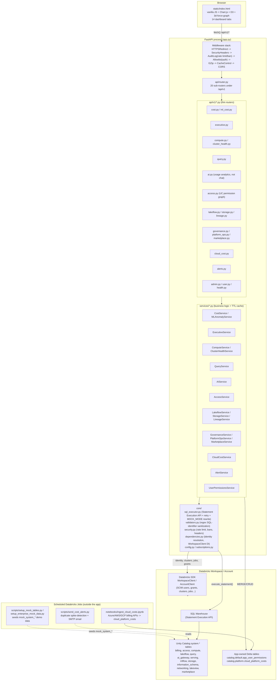
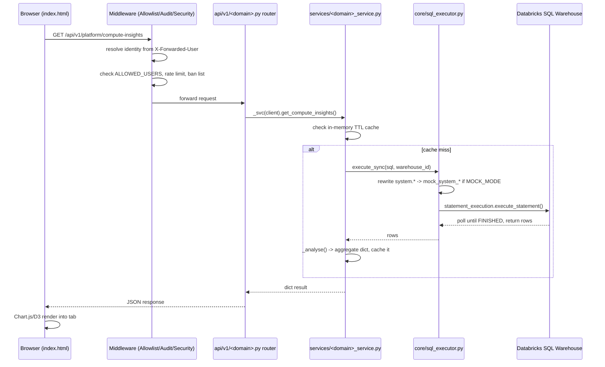

# Architecture — `databricks-cost-observability-main`

## Summary

A single-process **FastAPI** app deployed as a Databricks App. It serves both a JSON API (`/api/v1/*`) and a monolithic hand-authored `static/index.html` SPA (vanilla JS + Chart.js/D3/3d-force-graph, no build step) from the same process. It has **no database of its own** for the vast majority of features — it queries **Unity Catalog `system.*` tables** live via the Databricks SDK's Statement Execution API (SQL Warehouse REST calls, not JDBC/ODBC). Two exceptions: it owns a small `app_user_permissions` Delta table (per-user tab/workspace restrictions) and a `platform.cloud_platform_costs` Delta table (multi-cloud billing, populated by a separate ingestion notebook). A `MOCK_MODE` flag rewrites all `system.*` table references to `workspace.mock_system_*` so the app can run/demo on any workspace tier without real system-table access.

Auth is entirely delegated to the Databricks Apps reverse proxy: identity comes from forwarded headers (`X-Forwarded-User`, etc.), gated by an `ALLOWED_USERS` email allowlist and an `ADMIN_USERS` admin list — there is no app-level login, JWT, or subscription/license gate.

## Component Diagram

## Request-lifecycle sequence (typical dashboard tab load)

