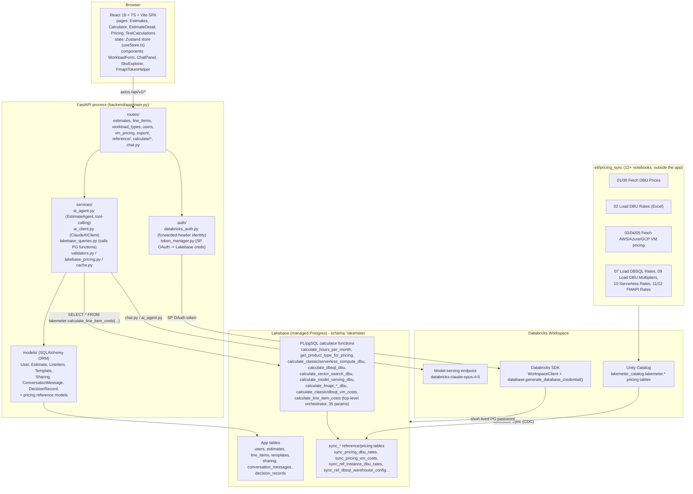
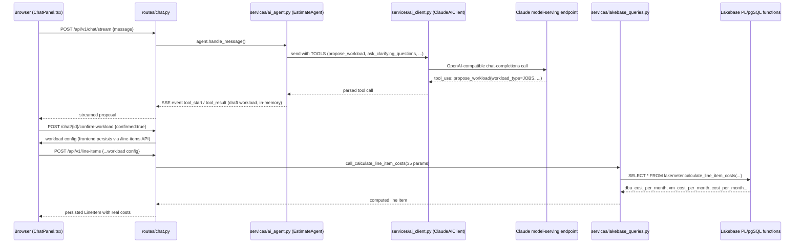

# Architecture — `lakemeter-oss-main`

## Summary

"Lakemeter" is a Databricks Labs open-source **cost estimation** tool (not observability of actual spend — it prices out *hypothetical* workload configurations before you run them). It's a **FastAPI backend + React/TypeScript/Vite SPA**, with its own **Lakebase (managed Postgres)** database holding application data (users, estimates, line items) and synced pricing/reference data (`sync_*` tables fed by a separate Unity-Catalog-based pricing ETL). The actual DBU/VM cost math is implemented as **PL/pgSQL functions inside Lakebase**, not in Python — the FastAPI routes validate input and call a single orchestrator function (`lakemeter.calculate_line_item_costs`). A built-in **AI Assistant** (Claude via a Databricks-hosted model-serving endpoint, tool-calling) lets users describe workloads in natural language and get proposed line items. Auth uses Databricks Apps forwarded headers + Service-Principal OAuth (via the SDK) for both user identity and for minting short-lived Lakebase database credentials. Deployment is a 9-task Databricks Asset Bundle (DAB) job pipeline invoked by a one-command installer script.

## Component Diagram

## AI Assistant sequence (natural-language workload proposal)

